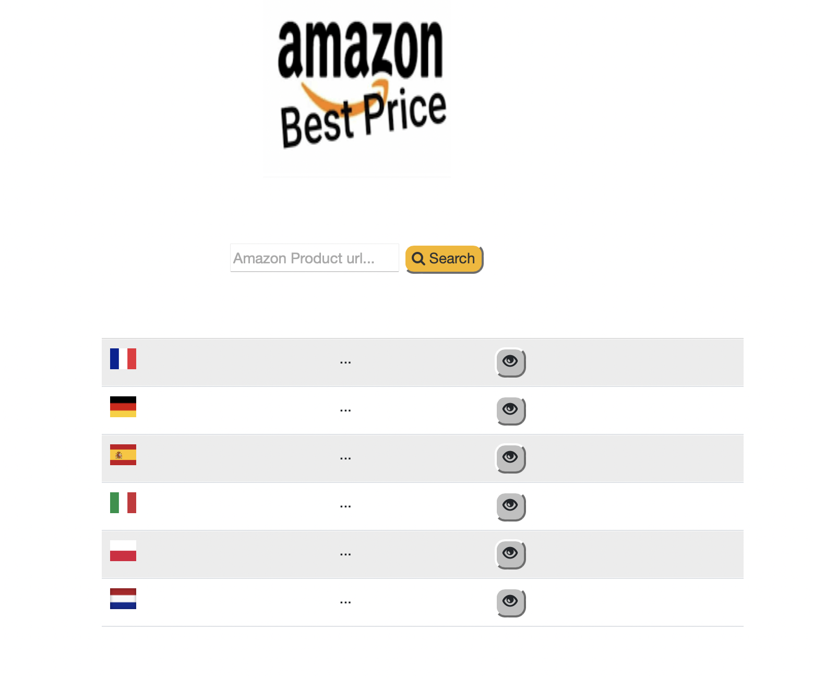
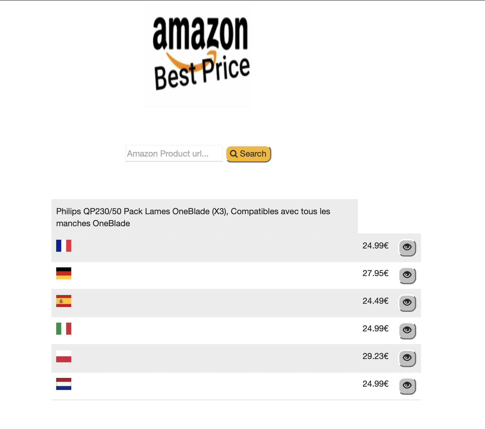

# projet_ece_big_data

Notre projet a pour objectif de récupérer les prix des sites amazon de différents pays et ainsi trouver le meilleur prix. Pour cela nous avons utiliser un bot amazon.

# Prérequis

Pour utiliser notre application vous devez installer docker et minikube. Dans le dossier source nous pourrons retrouver les fichiers de configurations de notre page web ainsi que notre script python qui correspond à une API python. En effet elle permet de récupérer le prix de chaque pays d'amazon. Nous pourrons également retrouver dans le dossier k8s les configurations de notre minikube.

# Utilisation de notre application

Récupérer le fichier .zip de notre git. Ensuite allez dans le dossier k8s et exécuter les commandes suivantes :

    - kubectl apply -f service.yaml

    - kubectl apply -f deployment.yaml
        
    - minikube tunnel

Ensuite utilisez votre navigateur et entrer dans la barre de recherche localhost:8080. Vous devez ensuite retrouver cette page ci-dessous :

Insérer dans la barre de recherche le lien amazon du produit que vous souhaité. Par exemple https://www.amazon.fr/Apple-Watch-Boîtier-Aluminium-Minuit-Bracelet/dp/B09HHGT5SS/ref=sr_1_5?crid=3L51IL1UWZA8T&keywords=apple+watch&qid=1640881748&sprefix=apple%2Caps%2C126&sr=8-5 qui correpond au lien amazon france de l'amazon. 
Vous devriez retrouver le résultat ci-dessous :

Nous observons donc qu'en france les rasoirs sont à 24 euros tandis qu'en Pologne ils sont a 29 euros.

# Auteur

 - Marwan LAAMOURI
 - Boran KOYUNCU
 - Arvind SAMY
 - Walid MANSOURI
